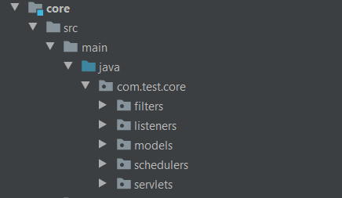
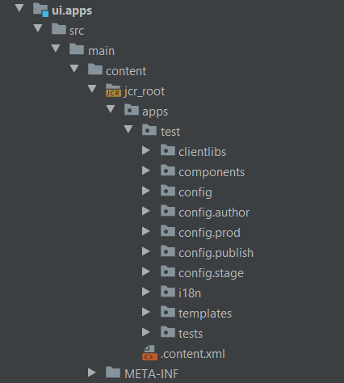

# Maven Project

We will create a new maven project for AEM and explain the basic structure.

Table of contents

- [Maven Project](#maven-project)
  - [Create a project](#create-a-project)
  - [Import a project](#import-a-project)
  - [Project structure](#project-structure)
  - [Push a project to AEM server instance](#push-a-project-to-aem-server-instance)

## Create a project

In order to create a project, move to your desired folder (example: `C:\Users\myself\Documents\MyMavenProjects\`) and execute the following command:
```
mvn archetype:generate -DarchetypeGroupId=com.adobe.granite.archetypes -DarchetypeArtifactId=aem-project-archetype -DarchetypeVersion=23 -DarchetypeRepository=https://repo.adobe.com/nexus/content/groups/public
```
This command will download the necessary files and will promt you to enter some fields:
- **groupId**: Base Maven groupId (example: com.test)
- **version**: Version of the project (example: 0.0.1)
- **package**: Java Source Package (example: com.test)
- **appId**: Will be used for component/config/content folders and css ids (example: test)
- **artifactId**: Base Maven ArtifactId (example: test-project)
- **appTitle**: Will be used for website title and components groups (example: Test Project)

Once you have enter all those fields, validate the command pressing `y`.

## Import a project

Open IntelliJ and click on `import project...`. Browse to the path where you created the project and select it.

Once you have imported the project, you will see a folder structure like this:


## Project structure

- **core**: package where the .java files are located
- **launcher**: package with code that will link the JUnit executions
- **tests**: package where the server-side JUnit is located
- **apps**: package where the components and the js/css files are located
- **content**: package that contains the structural content like templates or sites

The most important ones for now are `core` and `apps`.

**core**



Inside the core package, you can find 5 other package
- **filters**: filters the requests before dispatching them to the servlet
- **listeners**: detects every change on the resource structure
- **models**: stores the .java files that are associated with the components
- **schedulers**: stores cron-jobs
- **servlets**: renders the output of specific request like POST or GET

**apps**



Here there are many folders which are not interesting for now. We just want to know which are `components` and `clientlibs`.

- **components**: stores all the components you have created, and some that comes already made
- **clientlibs**: stores all the css & js files associated to each component

## Push a project to AEM server instance

In order to push your project, you may need to have your server instance running.

The command you need to run is:
```
mvn clean install -PautoInstallPackage -PautoInstallBundle -Padobe-public
```

Once the command ends, your project will be published and you can manage it from the web.


In the [next chapter](aem_interface/Readme.md) we will see how does AEM work and will move over the web.

---

**Guide contents**
- [Maven Project](maven_project/Readme.md)
- [AEM Interface](aem_interface/Readme.md)