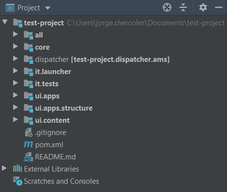
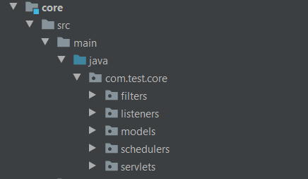
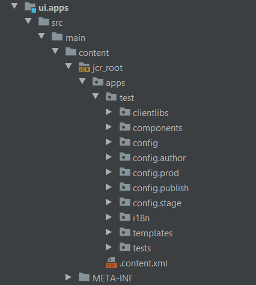
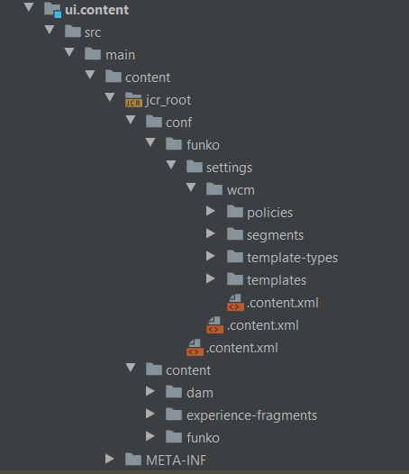
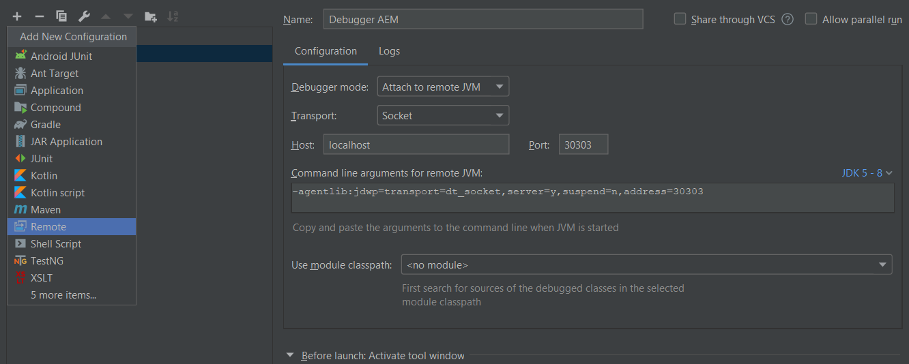

# Maven Project

**Overview**

We will create a new maven project for AEM and explain the basic structure.

**Table of contents**

- [Maven Project](#maven-project)
  - [Create a project](#create-a-project)
  - [Import project in IntelliJ IDEA](#import-project-in-intellij-idea)
  - [Project structure](#project-structure)
    - [core](#core)
    - [apps](#apps)
    - [content](#content)
  - [Run project](#run-project)
    - [Create a debug configuration in IntelliJ IDEA](#create-a-debug-configuration-in-intellij-idea)
  - [Push a project to AEM server instance](#push-a-project-to-aem-server-instance)

## Create a project

In order to create a project, move to your desired folder (example: `C:\Users\myself\Documents\MyMavenProjects\`) and execute the following command:
```
mvn archetype:generate -DarchetypeGroupId=com.adobe.granite.archetypes -DarchetypeArtifactId=aem-project-archetype -DarchetypeVersion=23 -DarchetypeRepository=https://repo.adobe.com/nexus/content/groups/public
```
This command will download the necessary files and will promt you to enter some fields:
- **groupId**: Base Maven groupId: `com.funko`
- **version**: Version of the project: `0.0.1`
- **package**: Java Source Package: `com.funko`
- **appId**: Will be used for component/config/content folders and css ids: `funko`
- **artifactId**: Base Maven ArtifactId: `funko`
- **appTitle**: Will be used for website title and components groups: `Funko`

&#9432; Further information can be found [here](https://github.com/adobe/aem-project-archetype#available-properties).

We will be working on a [Funko shop](https://funko.com/). All the assets we will be using are from there.

Once you have enter all those fields, validate the command pressing `y`.

## Import project in IntelliJ IDEA

Open IntelliJ and click on `import project...`. Browse to the path where you created the project and select it.

Once you have imported the project, you will see a folder structure like this:




## Project structure

- **core** Package where the .java files are located
- **launcher** Package with code that will link the JUnit executions
- **tests** Package where the server-side JUnit is located
- **apps** Package where the components and the js/css files are located
- **content** Package that contains the structural content like templates or sites

The most important ones for now are `core`, `apps` and `content`.

### core



Inside the core package, you can find 5 other package
- **filters** Filters the requests before dispatching them to the servlet
- **listeners** Detects every change on the resource structure
- **models** Stores the .java files that are associated with the components
- **schedulers** Stores cron-jobs
- **servlets** Renders the output of specific request like POST or GET

### apps



Here there are many folders which are not interesting for now. We just want to know which are `components`, `clientlibs` and `i18n`.

- **components** Stores all the components you have created, and some that comes already made
- **clientlibs** Stores all the css & js files associated to each component
- **i18n** Stores the traductions of the text displayed at the website

### content



Inside this package are going to be stored our `content fragments`, `experience fragments` and `templates`.

We will use this folder at [chapter 5](../5_content_fragments/Readme.md) (Content Fragments), so you can forget about it for now.

## Run project

In order to start the AEM server instance, you can have two options:

- Double click the `.jar` file of the server
- Run the `.jar` file in debugger mode

For the debug option, you need to execute the instance with the following command in the terminal:
```
java -jar  cq-author-p4502.jar -r local -fork -forkargs -- -Xdebug -Xrunjdwp:transport=dt_socket,address=30303,suspend=n,server=y -Dfile.encoding=UTF8 -Xmx4096m -XX:MaxPermSize=256m -XX:-UseSplitVerifier
```

### Create a debug configuration in IntelliJ IDEA

Creating a debug configuration in IntelliJ IDEA is very simple. You go to `Add Configuration...` in the upper right corner, and click the `+` icon.
<br>
Select the `Remote` template and replace the field `port` with `30303` (same as in the line code above)



And you are done! Next you just need to add a breakpoint in your `java class`, execute this configuration, and refresh the page where the component is rendering.

## Push a project to AEM server instance

In order to push your project, you may need to have your server instance running.

The command you need to run is:
```
mvn clean install -PautoInstallPackage -PautoInstallBundle -Padobe-public
```

Once the command ends, your project will be published and you can manage it from the web.

---

In the [next chapter](../2_aem_interface/Readme.md) (AEM Interface) we will see how does AEM work and will move over the web.

**Guide contents**
- [Maven Project](../1_maven_project/Readme.md)
- [AEM Interface](../2_aem_interface/Readme.md)
- [Components](../3_components/Readme.md)
- [Page Properties](../4_page_properties/Readme.md)
- [Content Fragments](../5_content_fragments/Readme.md)
- [Experience Fragments](../6_experience_fragments/Readme.md)
- [Templates](../7_templates/Readme.md)
- [Query Builder](../8_query_builder/Readme.md)
