# AEM Interface

**Overview**

We will take a look to the AEM web and check where and how is the data stored, and some important directories that we will be using during this guide.

**Table of contents**

- [AEM Interface](#aem-interface)
  - [Start Page](#start-page)
  - [Sites](#sites)
  - [Assets](#assets)
  - [CRXDE Lite](#crxde-lite)
  - [Tagging](#tagging)
  - [Templates](#templates)
  - [Content Fragment Models](#content-fragment-models)
  - [Other Useful Links](#other-useful-links)

## Start Page

Once we have login into the server (by default `admin:admin`), we are going to see the main menu.

From here we can access almost every thing from the CMS.

The most important are `Sites` and `Assets`.

If we click the hammer button (Tools), we can access some other features like the `CRXDE Lite`, the `Tagging` system, `Templates` manager, etc. And other options at the side panel.

We can access both menus by clicking at the top nav menu `Adobe Experience Fragment`.

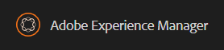

## Sites

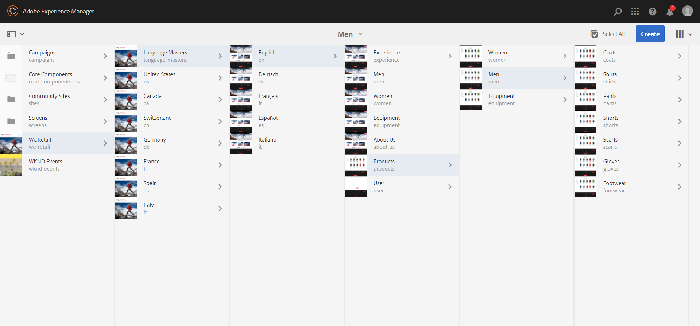

In this menu we can browse over all our projects and see the content inside it. These content will be the pages of our website.

We can create more by selecting the page and clicking in `create`.

By default, the server has a default site called We.Retail, and we can see all the pages that are inside of it.

## Assets

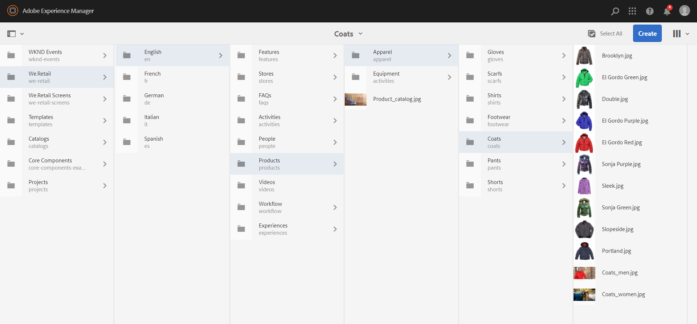

Here we can see all the assets of the projects. They can be any kind of assets we want. We will store here our images and other necessary data like `Content Fragments`.

We can upload or create assets clicking in `create`.

## CRXDE Lite

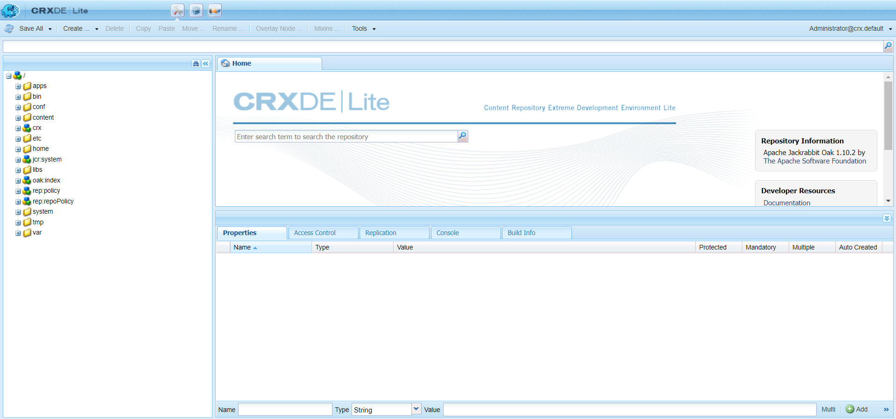

This is probably the best tool that AEM provides us. This admin panel represents the database itself. Here we can see all the information stored and we can operate with it from here.

Most of the paths are similar to your maven project structure.

&#9888; **WARNING**: be careful with this tool, since every thing you update here, cannot be undone and not all the data is stored in your code.

## Tagging

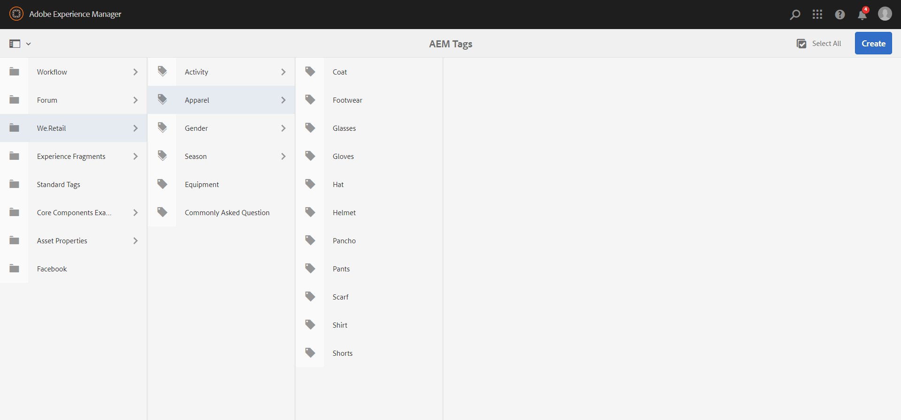

If you need some tags to make your life easier when searching nodes, here you can create them.

You can create a new namespace or add one tag to the current namespace selected clicking `create`.

## Templates

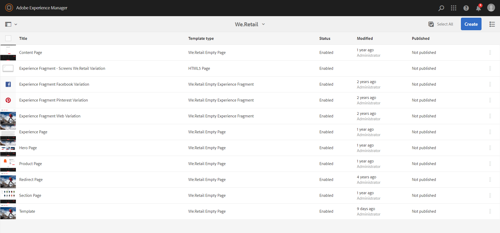

Here you can see all the templates of every project you have.

You can edit or create templates from here, but later on we will see how to create them by xml files inside our maven project.

## Content Fragment Models

If we go to `Assets` (side panel of the Tools) and click on the `Content Fragment Models` menu

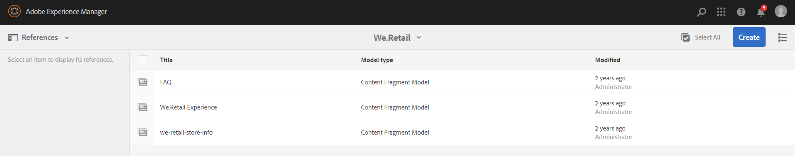

We can see the content fragments of all our projects, edit and create them. Anyway, as same as templates, we will create them coding.

## Other Useful Links

- Bundles
  
  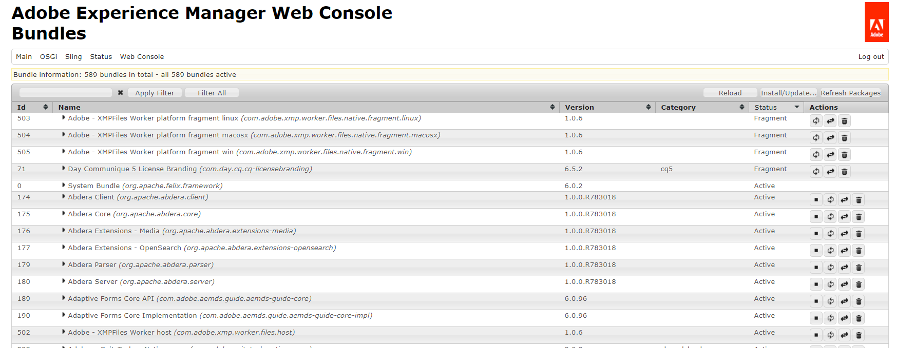
  Can be found under the path `http://localhost:4502/system/console/bundles`

- Components
  
  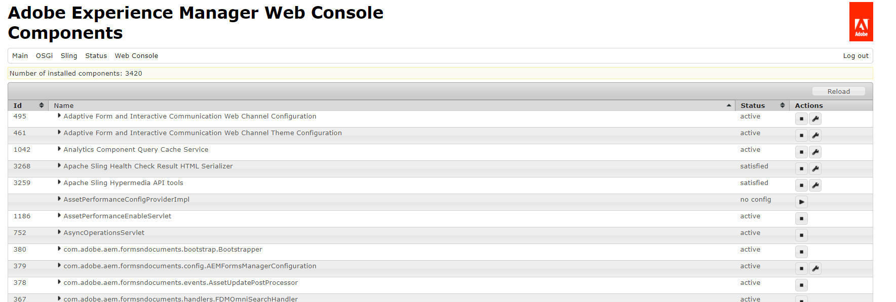
  Can be found under the path `http://localhost:4502/system/console/components`

  

- Config Manager

  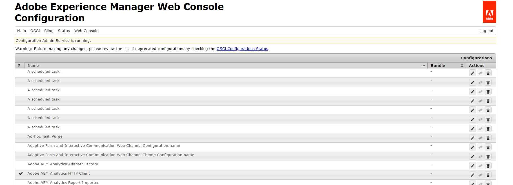
  Can be found under the path `http://localhost:4502/system/console/configMgr`

  

- CRX Explorer
  
  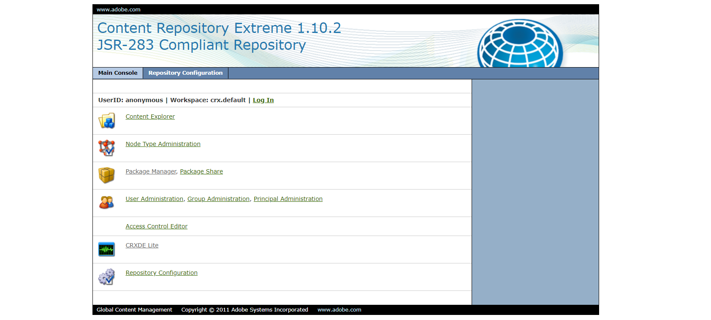
  Can be found under the path `http://localhost:4502/crx/explorer/index.jsp`

- QueryBuilder Debugger
  
  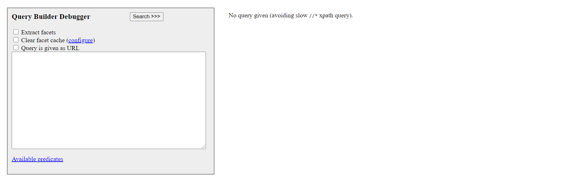
  Can be found under the path `http://localhost:4502/libs/cq/search/content/querydebug.html`

  Very useful tool to create and preview queries to the database. We will be using it in the [chapter 8 (Query Builder)](../8_query_builder/Readme.md).

- Replication Agents
  
  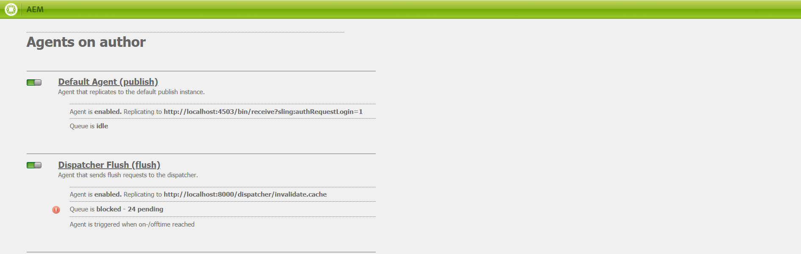
  Can be found under the path `http://localhost:4502/etc/replication/agents.author.html`

  From this path, you can manage how the author interacts with other instances, like the `Publish instance` or the `Dispatcher instance`.

---

In the [next chapter](../3_components/Readme.md) (Components) we will create our first component and use it in a simple page.

**Guide contents**
- [Maven Project](../1_maven_project/Readme.md)
- [AEM Interface](../2_aem_interface/Readme.md)
- [Components](../3_components/Readme.md)
- [Page Properties](../4_page_properties/Readme.md)
- [Content Fragments](../5_content_fragments/Readme.md)
- [Experience Fragments](../6_experience_fragments/Readme.md)
- [Templates](../7_templates/Readme.md)
- [Query Builder](../8_query_builder/Readme.md)