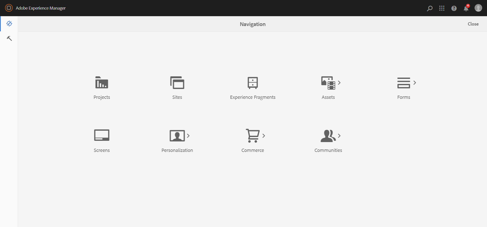
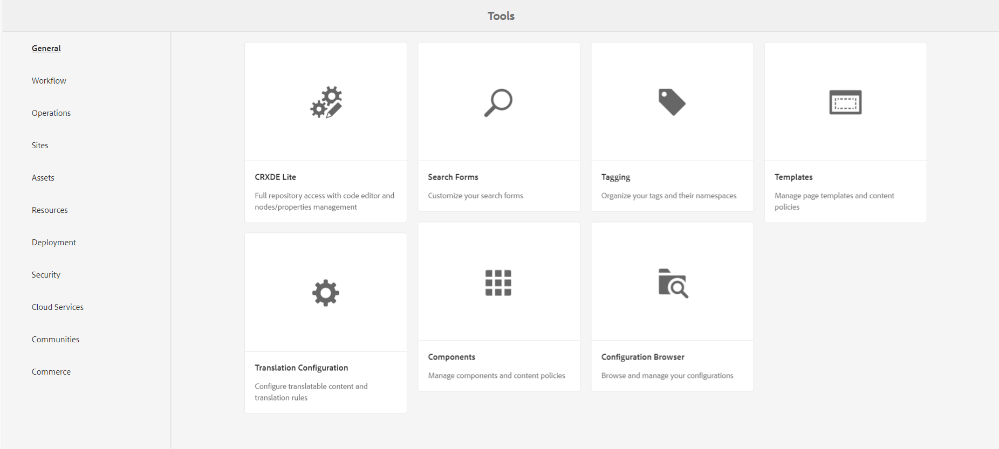

# AEM Interface

We will have a preview of the AEM web to understand how it works.

Table of contents

- [AEM Interface](#aem-interface)
  - [AEM Start Page](#aem-start-page)

## AEM Start Page

Once we have login into the server (by default `admin:admin`), we are going to see the main menu.

From here we can access almost every thing from the CMS.

We have some links to `Projects`, `Sites`, `Assets` etc. And a toolbar to the left. If we click the hammer button (Tools), we can access some other features like the `CRXDE Lite`, the `Tagging` system, `Templates` manager, etc.

---

**Guide contents**
- [Maven Project](../1_maven_project/Readme.md)
- [AEM Interface](../2_aem_interface/Readme.md)
- [Components](../3_components/Readme.md)
- [Page Properties](../4_page_properties/Readme.md)
- [Component Fragments](../5_component_fragments/Readme.md)
- [Experience Fragments](../6_experience_fragments/Readme.md)
- [Templates](../7_templates/Readme.md)
- [Query Builder](../8_query_builder/Readme.md)