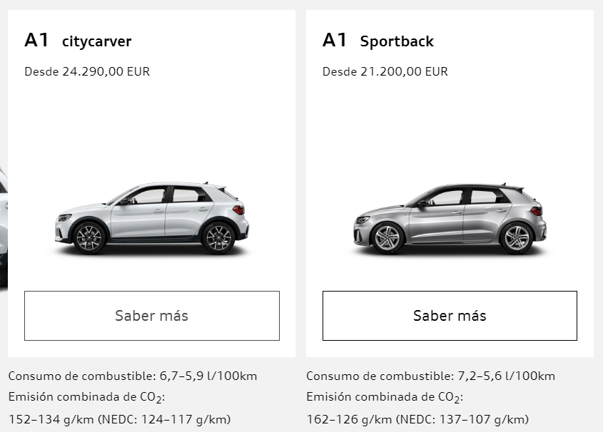
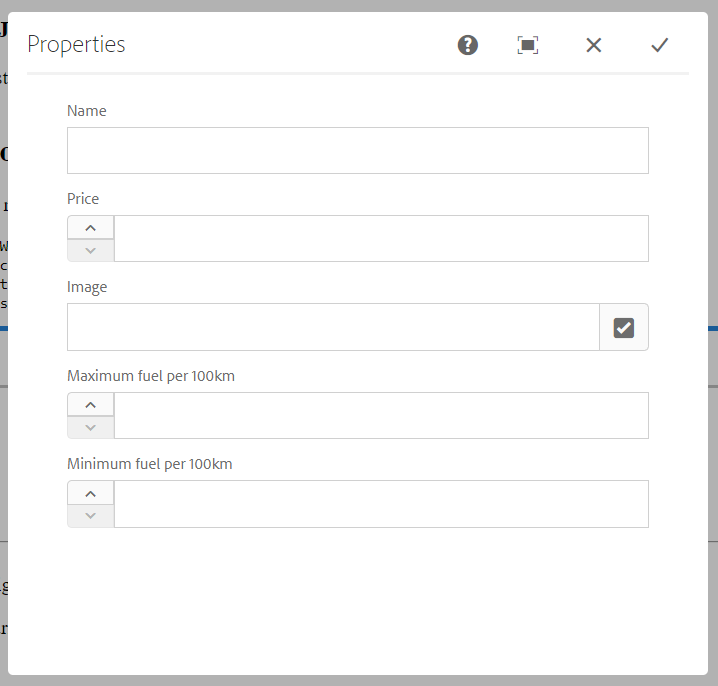
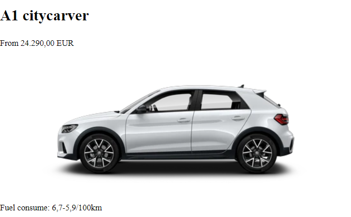
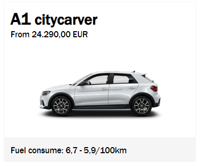

# Components

As AEM is component oriented, understanding them is very important.

Table of contents

- [Components](#components)
  - [Component Structure](#component-structure)
    - [_cq_dialog/.content.xml](#cqdialogcontentxml)
    - [.content.xml](#contentxml)
    - [HelloWorldModel.java](#helloworldmodeljava)
    - [helloworld.html](#helloworldhtml)
  - [My First Component](#my-first-component)
    - [Dialog](#dialog)
    - [Controller](#controller)
    - [Template HTML](#template-html)
    - [CSS](#css)

## Component Structure

As we saw at [chapter 1](../1_maven_project/Readme.md), we can find our components under `ui.apps`.

We can see that there are a lot of them already in our folder. If we check the list, we can find a component called `helloworld`.


At `core` we can find the controller of this component


Most of the times, copying this folder and customizing it is the best for creating new components, since it is hard to remember all the contents inside it.

### _cq_dialog/.content.xml

In AEM web, if we edit the page `en` under `sites > audi > us`, we can see that a component `helloworld` is instantiated if we click and cofigure it, we can see a dialog asking for a title:


This dialog is the html representation of the `.xml` file.

The content of the file is this:

```
<?xml version="1.0" encoding="UTF-8"?>
<jcr:root xmlns:sling="http://sling.apache.org/jcr/sling/1.0" xmlns:cq="http://www.day.com/jcr/cq/1.0" xmlns:jcr="http://www.jcp.org/jcr/1.0" xmlns:nt="http://www.jcp.org/jcr/nt/1.0"
    jcr:primaryType="nt:unstructured"
    jcr:title="Properties"
    sling:resourceType="cq/gui/components/authoring/dialog">
    <content
        jcr:primaryType="nt:unstructured"
        sling:resourceType="granite/ui/components/coral/foundation/fixedcolumns">
        <items jcr:primaryType="nt:unstructured">
            <column
                jcr:primaryType="nt:unstructured"
                sling:resourceType="granite/ui/components/coral/foundation/container">
                <items jcr:primaryType="nt:unstructured">
                    <text
                        jcr:primaryType="nt:unstructured"
                        sling:resourceType="granite/ui/components/coral/foundation/form/textfield"
                        fieldLabel="Text"
                        name="./text"/>
                </items>
            </column>
        </items>
    </content>
</jcr:root>
```

- **jcr:primaryType** By default we will always use `nt:unstructured`
- **sling:resourceType** This input type is defined at `granite/ui/components/coral/foundation/form/textfield`, this represents the data type of our input
- **fieldLabel** The label of the input on the dialog
- **name** The name of the input we will refer to access it

You can find more documentation about all the inputs available and its properties for this type of file [here](https://helpx.adobe.com/experience-manager/6-4/sites/developing/using/reference-materials/granite-ui/api/jcr_root/libs/granite/ui/components/coral/foundation/server.html).

### .content.xml
```
<?xml version="1.0" encoding="UTF-8"?>
<jcr:root xmlns:cq="http://www.day.com/jcr/cq/1.0" xmlns:jcr="http://www.jcp.org/jcr/1.0"
    jcr:primaryType="cq:Component"
    jcr:title="Hello World Component"
    componentGroup="Audi - Content"/>
```

This file is the most important of a component, it defines the following:

- **jcr:primaryType** Defines the type of the package, in this case it is a component (`cq:Component`)
- **jcr:title** This is the name with which it will appear when we search for it
- **componentGroup** The component group at which it belongs. Later on, we can use this field to create custom policies for our templates

### HelloWorldModel.java

```
package com.audi.core.models;

import static org.apache.sling.api.resource.ResourceResolver.PROPERTY_RESOURCE_TYPE;

import javax.annotation.PostConstruct;

import org.apache.sling.api.resource.Resource;
import org.apache.sling.api.resource.ResourceResolver;
import org.apache.sling.models.annotations.Default;
import org.apache.sling.models.annotations.Model;
import org.apache.sling.models.annotations.injectorspecific.InjectionStrategy;
import org.apache.sling.models.annotations.injectorspecific.OSGiService;
import org.apache.sling.models.annotations.injectorspecific.SlingObject;
import org.apache.sling.models.annotations.injectorspecific.ValueMapValue;
import org.apache.sling.settings.SlingSettingsService;

import com.day.cq.wcm.api.Page;
import com.day.cq.wcm.api.PageManager;

import java.util.Optional;

@Model(adaptables = Resource.class)
public class HelloWorldModel {

    @ValueMapValue(name=PROPERTY_RESOURCE_TYPE, injectionStrategy=InjectionStrategy.OPTIONAL)
    @Default(values="No resourceType")
    protected String resourceType;

    @OSGiService
    private SlingSettingsService settings;
    @SlingObject
    private Resource currentResource;
    @SlingObject
    private ResourceResolver resourceResolver;

    private String message;

    @PostConstruct
    protected void init() {
        PageManager pageManager = resourceResolver.adaptTo(PageManager.class);
        String currentPagePath = Optional.ofNullable(pageManager)
                .map(pm -> pm.getContainingPage(currentResource))
                .map(Page::getPath).orElse("");

        message = "Hello World!\n"
            + "Resource type is: " + resourceType + "\n"
            + "Current page is:  " + currentPagePath + "\n"
            + "This is instance: " + settings.getSlingId() + "\n";
    }

    public String getMessage() {
        return message;
    }

}
```

This file is the controller of the `helloworld component`.

This file will handle the save of our dialog on the database.

In the [helloworld.html](#helloworldhtml) file it access the input `text` with `properties.text`, but later on, in [my first component](#my-first-component) section, we will access it in another way from our controller.

### helloworld.html
```
<div class="cmp-helloworld" data-cmp-is="helloworld">
    <h2 class="cmp-helloworld__title">Hello World Component</h2>
    <div class="cmp-helloworld__item" data-sly-test="${properties.text}">
        <p class="cmp-helloworld__item-label">Text property:</p>
        <pre class="cmp-helloworld__item-output" data-cmp-hook-helloworld="property">${properties.text}</pre>
    </div>
    <div class="cmp-helloworld__item" data-sly-use.model="com.audi.core.models.HelloWorldModel" data-sly-test="${model.message}">
        <p class="cmp-helloworld__item-label">Model message:</p>
        <pre class="cmp-helloworld__item-output"data-cmp-hook-helloworld="model">${model.message}</pre>
    </div>
</div>
```

Just a basic html structure with css classes and some `sly tags`. These sly tags are used to access the controller of our component and add some logic to our html, it is similar to jsp files.

You can find a good documentation about these tags [here](https://github.com/adobe/htl-spec/blob/master/SPECIFICATION.md).

## My First Component

We are going to create a component that will store some information about an audi car. If we check the [audi web](https://www.audi.es/es/web/es/modelos.html?pid=int:home:menu:modelos), we can see a very obvious component:



Lets model it for our component.

First of all, copy the helloworld and rename it as `audicar`.

Rename also the html file with the same name and empty it, since it is going to be different.

&#9888; **WARNING**: the name of the component folder and the html file has to be the same. AEM is very strict with the names of the files.

You also need to modify the `jcr:title`, for example to `Audi Car`, at the `.content.xml`.

Once we have the structure created, lets just analize what do we need for our component.

- **Name**
- **Price**
- **Serie** Will store the series of the car if present
- **Image**
- **Max & Min fuel**

These fields seem enough for our first component, so let's get to work.

### Dialog

Inside the inner `items` tag of the `_cq_dialog/.content.xml`, copy this (after removing the text tag):

```
<name
    jcr:primaryType="nt:unstructured"
    sling:resourceType="granite/ui/components/coral/foundation/form/textfield"
    fieldLabel="Name"
    name="./name"/>
<price
    jcr:primaryType="nt:unstructured"
    sling:resourceType="granite/ui/components/coral/foundation/form/numberfield"
    fieldLabel="Price"
    step="any"
    min="0"
    name="./price"/>
<image
    jcr:primaryType="nt:unstructured"
    sling:resourceType="granite/ui/components/coral/foundation/form/pathfield"
    rootPath="/content/dam/audi"
    fieldLabel="Image"
    name="./image"/>
<serie
    jcr:primaryType="nt:unstructured"
    sling:resourceType="granite/ui/components/coral/foundation/form/textfield"
    fieldLabel="Serie"
    name="./serie"/>
<max-fuel
    jcr:primaryType="nt:unstructured"
    sling:resourceType="granite/ui/components/coral/foundation/form/numberfield"
    fieldLabel="Maximum fuel per 100km"
    step="0.1"
    min="0"
    name="./max-fuel"/>
<min-fuel
    jcr:primaryType="nt:unstructured"
    sling:resourceType="granite/ui/components/coral/foundation/form/numberfield"
    fieldLabel="Minimum fuel per 100km"
    step="0.1"
    min="0"
    name="./min-fuel"/>
```

Here we define each of the fields we want our dialog to have. Remember you can check the list of fields privided by adobe [here](https://helpx.adobe.com/experience-manager/6-4/sites/developing/using/reference-materials/granite-ui/api/jcr_root/libs/granite/ui/components/coral/foundation/server.html).

If we push our project to the server, we can now add our component to the page.

We won't be see anything, but if you open the `Content Tree` you can see your component there. If you select and cofigure it, you will see the dialog we just created.



Of course, we won't be able to see any output, since the `.html` file is empty.

But first, let's create our controller.

### Controller

Go to `core > models`, create a class `AudiCarModel` and copy paste this code:
```
package com.audi.core.models;

import static org.apache.sling.api.resource.ResourceResolver.PROPERTY_RESOURCE_TYPE;

import javax.annotation.PostConstruct;

import org.apache.sling.api.resource.Resource;
import org.apache.sling.models.annotations.Default;
import org.apache.sling.models.annotations.Model;
import org.apache.sling.models.annotations.injectorspecific.InjectionStrategy;
import org.apache.sling.models.annotations.injectorspecific.SlingObject;
import org.apache.sling.models.annotations.injectorspecific.ValueMapValue;

@Model(adaptables = Resource.class)
public class AudiCarModel {

    @ValueMapValue(name = PROPERTY_RESOURCE_TYPE, injectionStrategy = InjectionStrategy.OPTIONAL)
    @Default(values = "No resourceType")
    protected String resourceType;

    @SlingObject
    private Resource currentResource;

    @PostConstruct
    protected void init() {

    }
}
```

This is the basic component controller class. Now we need to create one field per each field of the dialog, with its respective getter.

```
    private String name;
    private String price;
    private String image;
    private String serie;
    private String max_fuel;
    private String min_fuel;

    public String getName() {
        return name;
    }

    public String getPrice() {
        return price;
    }

    public String getImage() {
        return image;
    }

    public String getSerie() {
        return serie;
    }

    public String getMax_fuel() {
        return max_fuel;
    }

    public String getMin_fuel() {
        return min_fuel;
    }
```

Now we need to link this fields with the current values of the dialog.

To do this, copy this code inside the `init()` method:

```
    this.name = currentResource.getValueMap().get("name", String.class);
    this.price = currentResource.getValueMap().get("price", String.class);
    this.image = currentResource.getValueMap().get("image", String.class);
    this.serie = currentResource.getValueMap().get("serie", String.class);
    this.max_fuel = currentResource.getValueMap().get("max-fuel", String.class);
    this.min_fuel = currentResource.getValueMap().get("min-fuel", String.class);
```

What we are doing here is:

- Getting the current resource (`currentResource`) which is our dialog
- Get the value map of the dialog (mostly everything in AEM works as a map)
- Select the value we want, casting it to a String

&#9888; **IMPORTANT**: The first param of `getValue()` has to be the same value as the name we used at our `_cq_dialog/.content.xml` file at the current field

Once we have our controller, we can create our template html.

### Template HTML

Inside our `audicar.html` we need to copy this line at the beggining:
```
<sly data-sly-use.audiCar="com.audi.core.models.AudiCarModel"/>
```
With this line of code, we refer our model and can access every get we have.

Now we can create a layout similar to the given in audi page.
```
<sly data-sly-use.audiCar="com.audi.core.models.AudiCarModel"/>
<!--/* If the audicar name & image is set */-->
<sly data-sly-test="${audiCar && audiCar.name && audiCar.image}">
    <div class="audi-car">
        <div class="audi-car-header">
            <h2>
                <!--/* If the serie of the car is set */-->
                <sly data-sly-test="${audiCar.serie}">
                    <span>${audiCar.serie}</span>
                </sly>
                <span>${audiCar.name}</span>
            </h2>
            <!--/* If the price of the car is set */-->
            <sly data-sly-test="${audiCar.price}">
                <!--/* Formats the car price */-->
                <small>From ${'#,###.00' @ format=audiCar.price} EUR</small>
            </sly>
        </div>
        <div class="audi-car-body">
            
        </div>
        <!--/* If the max or min fuel of the car is set */-->
        <sly data-sly-test="${audiCar.max_fuel || audiCar.min_fuel}">
            <div class="audi-car-footer">
                <small>Fuel consume: ${'#.0' @ format=audiCar.max_fuel}-${'#.0' @ format=audiCar.min_fuel}/100km</small>
            </div>
        </sly>
    </div>
</sly>
```

As you can see, we are using the `sly tags`. You can find more information about them [here](https://github.com/adobe/htl-spec/blob/master/SPECIFICATION.md).

We are limitating the html render if there is no content available to show, and forcing at least the name and the image to create some content.

If we push again our project to the server and fill all the data of the dialog (remember you can upload files from the `assets` menu of AEM), we can see our basic layout:



It works. But this is pretty ugly. Lets add some css.

### CSS

Inside the `clientlibs` package, create a folder named `clientlib-audicar`.

&#9888; **IMPORTANT**: The name has to be exactly like that one.

1. Create a `.content.xml` file woth the following data:
    ```
    <?xml version="1.0" encoding="UTF-8"?>
    <jcr:root xmlns:cq="http://www.day.com/jcr/cq/1.0" xmlns:jcr="http://www.jcp.org/jcr/1.0"
            jcr:primaryType="cq:ClientLibraryFolder"
            categories="[audi.car]" />
    ```
- **jcr:primaryType** specifies that the package is a client lib folder
- **categories** reference to access this package. It can have more than one value

2. Create a folder named `css` and create a file names `styles.less`.

    This file will be the css that we want to apply to our component. The file can be also a `.css` file.
    The content of this file
    ```
    .audi-car {
        width           : 20%;
        background-color: white;
        font-family     : 'Franklin Gothic Medium', 'Arial Narrow', Arial, sans-serif;
        border          : 1px solid whitesmoke;
    }

    .audi-car-header {
        padding: 10px;

        h2 {
            margin: 0;
        }

        span {
            font-weight: bold;
            font-size  : 20pt;

            &:nth-last-of-type(1) {
                font-size: inherit;
            }
        }
    }

    .audi-car-body {
        padding: 10px;

        img {
            width : 100%;
            height: auto;
        }
    }

    .audi-car-footer {
        padding         : 10px;
        background-color: whitesmoke;
    }
    ```

3. Create a `css.txt` file and add the following lines:
    ```
    #base=css
    styles.less
    ```

    Here we indicate that the css file is stored under `css` folder.

4. Before pushing your project, open the `html` template of the component and add:
    ```
    <sly data-sly-use.clientlib="/libs/granite/sightly/templates/clientlib.html"
     data-sly-call="${clientlib.css @ categories='audi.car'}"/>
    ```

    This way, we link the `css styles`. Notice that the categories is the same as the clientlib `.content.xml`.

The output once we refresh the website should be like this:




In the [next chapter](../4_page_properties/Readme.md) (Page Properties) we will use the page properties and customize them.

---

**Guide contents**
- [Maven Project](../1_maven_project/Readme.md)
- [AEM Interface](../2_aem_interface/Readme.md)
- [Components](../3_components/Readme.md)
- [Page Properties](../4_page_properties/Readme.md)
- [Component Fragments](../5_component_fragments/Readme.md)
- [Experience Fragments](../6_experience_fragments/Readme.md)
- [Templates](../7_templates/Readme.md)
- [Query Builder](../8_query_builder/Readme.md)