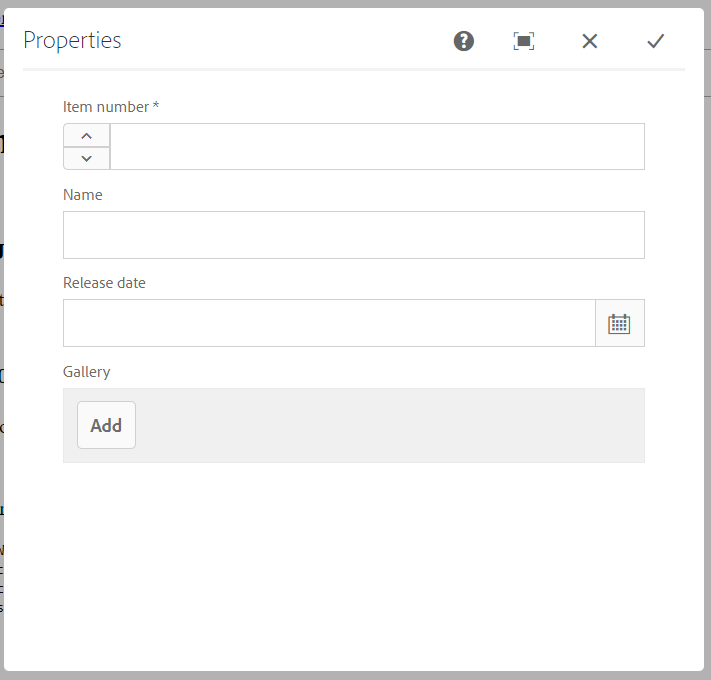

# Components

**Overview**

As AEM is component oriented, understanding them is very important. We will see how is the structure of a basic component (`helloworld`) and then we will create our own component.

**Table of contents**

- [Components](#components)
  - [Component Structure](#component-structure)
    - [_cq_dialog/.content.xml](#cqdialogcontentxml)
    - [.content.xml](#contentxml)
    - [HelloWorldModel.java](#helloworldmodeljava)
    - [helloworld.html](#helloworldhtml)
  - [My First Component](#my-first-component)
    - [Dialog](#dialog)
    - [Controller](#controller)
    - [HTML Template](#html-template)
    - [CSS & JS](#css--js)

## Component Structure

As we saw at [chapter 1](../1_maven_project/Readme.md#apps), we can find our components under `ui.apps`.

We can see that there are a lot of them already in our folder. If we check the list, we can find a component called `helloworld`.


At `core` we can find the controller of this component


Most of the times, copying this folder and customizing it is the best for creating new components, since it is hard to remember all the contents inside it.

### _cq_dialog/.content.xml

In AEM web, if we edit the page `en` under `sites > funko > us`, we can see that a component `helloworld` is instantiated if we click and cofigure it, we can see a dialog asking for a title:


This dialog is the html representation of the `.xml` file.

The content of the file is this:
```
<?xml version="1.0" encoding="UTF-8"?>
<jcr:root xmlns:sling="http://sling.apache.org/jcr/sling/1.0" xmlns:cq="http://www.day.com/jcr/cq/1.0" xmlns:jcr="http://www.jcp.org/jcr/1.0" xmlns:nt="http://www.jcp.org/jcr/nt/1.0"
    jcr:primaryType="nt:unstructured"
    jcr:title="Properties"
    sling:resourceType="cq/gui/components/authoring/dialog">
    <content
        jcr:primaryType="nt:unstructured"
        sling:resourceType="granite/ui/components/coral/foundation/fixedcolumns">
        <items jcr:primaryType="nt:unstructured">
            <column
                jcr:primaryType="nt:unstructured"
                sling:resourceType="granite/ui/components/coral/foundation/container">
                <items jcr:primaryType="nt:unstructured">
                    <text
                        jcr:primaryType="nt:unstructured"
                        sling:resourceType="granite/ui/components/coral/foundation/form/textfield"
                        fieldLabel="Text"
                        name="./text"/>
                </items>
            </column>
        </items>
    </content>
</jcr:root>
```

- **jcr:primaryType** By default we will always use `nt:unstructured`
- **sling:resourceType** This input type is defined at `granite/ui/components/coral/foundation/form/textfield`, this represents the data type of our input, in this case, a text input
- **fieldLabel** The label of the input on the dialog
- **name** The name of the input we will refer to access it

You can find more documentation about all the inputs available and its properties for this type of file [here](https://helpx.adobe.com/experience-manager/6-4/sites/developing/using/reference-materials/granite-ui/api/jcr_root/libs/granite/ui/components/coral/foundation/server.html).

### .content.xml
```
<?xml version="1.0" encoding="UTF-8"?>
<jcr:root xmlns:cq="http://www.day.com/jcr/cq/1.0" xmlns:jcr="http://www.jcp.org/jcr/1.0"
    jcr:primaryType="cq:Component"
    jcr:title="Hello World Component"
    componentGroup="Funko - Content"/>
```

This file is the most important of a component, it defines the following:

- **jcr:primaryType** Defines the type of the package, in this case it is a component (`cq:Component`)
- **jcr:title** This is the name with which it will appear when we search for it
- **componentGroup** The component group at which it belongs. Later on, we can use this field to create custom policies for our templates

### HelloWorldModel.java
```
package com.funko.core.models;

import static org.apache.sling.api.resource.ResourceResolver.PROPERTY_RESOURCE_TYPE;

import javax.annotation.PostConstruct;

import org.apache.sling.api.resource.Resource;
import org.apache.sling.api.resource.ResourceResolver;
import org.apache.sling.models.annotations.Default;
import org.apache.sling.models.annotations.Model;
import org.apache.sling.models.annotations.injectorspecific.InjectionStrategy;
import org.apache.sling.models.annotations.injectorspecific.OSGiService;
import org.apache.sling.models.annotations.injectorspecific.SlingObject;
import org.apache.sling.models.annotations.injectorspecific.ValueMapValue;
import org.apache.sling.settings.SlingSettingsService;

import com.day.cq.wcm.api.Page;
import com.day.cq.wcm.api.PageManager;

import java.util.Optional;

@Model(adaptables = Resource.class)
public class HelloWorldModel {

    @ValueMapValue(name=PROPERTY_RESOURCE_TYPE, injectionStrategy=InjectionStrategy.OPTIONAL)
    @Default(values="No resourceType")
    protected String resourceType;

    @OSGiService
    private SlingSettingsService settings;
    @SlingObject
    private Resource currentResource;
    @SlingObject
    private ResourceResolver resourceResolver;

    private String message;

    @PostConstruct
    protected void init() {
        PageManager pageManager = resourceResolver.adaptTo(PageManager.class);
        String currentPagePath = Optional.ofNullable(pageManager)
                .map(pm -> pm.getContainingPage(currentResource))
                .map(Page::getPath).orElse("");

        message = "Hello World!\n"
            + "Resource type is: " + resourceType + "\n"
            + "Current page is:  " + currentPagePath + "\n"
            + "This is instance: " + settings.getSlingId() + "\n";
    }

    public String getMessage() {
        return message;
    }

}
```

This file is the controller of the `helloworld component`.

This file will handle the save of our dialog on the database.

### helloworld.html
```
<div class="cmp-helloworld" data-cmp-is="helloworld">
    <h2 class="cmp-helloworld__title">Hello World Component</h2>
    <div class="cmp-helloworld__item" data-sly-test="${properties.text}">
        <p class="cmp-helloworld__item-label">Text property:</p>
        <pre class="cmp-helloworld__item-output" data-cmp-hook-helloworld="property">${properties.text}</pre>
    </div>
    <div class="cmp-helloworld__item" data-sly-use.model="com.funko.core.models.HelloWorldModel" data-sly-test="${model.message}">
        <p class="cmp-helloworld__item-label">Model message:</p>
        <pre class="cmp-helloworld__item-output"data-cmp-hook-helloworld="model">${model.message}</pre>
    </div>
</div>
```
Just a basic html structure with css classes and some `sly tags`. These sly tags are used to access the controller of our component and add some logic to our html, it is similar to jsp files.

Here, the component access the input `text` with `properties.text`, but later on, in [my first component](#my-first-component) section, we will access it in another way from our controller.

You can find a good documentation about these tags [here](https://github.com/adobe/htl-spec/blob/master/SPECIFICATION.md).

## My First Component

We are going to create a component that will store some information about a funko pop. If we check a [funko product](https://www.funko.com/products/animation/pop/pokemon/charmander-flocked), we can find some useful information so, let's model it for our component.

First of all, create a folder named `funko` to store all our custom components there (this is just for organization, it is not necessary). Then copy the helloworld component inside this folder and rename it as `funkoProduct`.

Rename also the html file with the same name and empty it, since it is going to be different.

&#9888; **WARNING**: the name of the component folder and the html file has to be the same. AEM is very strict with the names of the files.

You also need to modify the `jcr:title`, for example to `Funko Product`, at the `.content.xml`.

Once we have the structure created, lets just analize what do we need for our component.
- **Item Number** The item number of the funko
- **Name** The name of the funko
- **Release** The date when the funko was release
- **Status** If the funko is available or not (we will calculate this value, so it won't be inside the dialog)
- **Gallery** Group of images to display

### Dialog

First of all, we need to create or dialog, so open the `.content.xml` file inside the folder `_cq_dialog`.

Inside of the inner item tag, paste this code:
```
<item-no
        jcr:primaryType="nt:unstructured"
        sling:resourceType="granite/ui/components/coral/foundation/form/numberfield"
        fieldLabel="Item number"
        step="1"
        name="./item-no"/>
<name
        jcr:primaryType="nt:unstructured"
        sling:resourceType="granite/ui/components/coral/foundation/form/textfield"
        fieldLabel="Name"
        name="./name"/>
<release
        jcr:primaryType="nt:unstructured"
        sling:resourceType="granite/ui/components/coral/foundation/form/datepicker"
        valueFormat="YYYY-MM-DD"
        fieldLabel="Release date"
        name="./release"/>
<multi
        jcr:primaryType="nt:unstructured"
        sling:resourceType="granite/ui/components/coral/foundation/form/multifield"
        composite="{Boolean}true"
        fieldLabel="Gallery">
    <field
            sling:resourceType="granite/ui/components/coral/foundation/container"
            jcr:primaryType="nt:unstructured"
            name="./gallery">
        <items jcr:primaryType="nt:unstructured">
            <image
                jcr:primaryType="nt:unstructured"
                sling:resourceType="granite/ui/components/coral/foundation/form/pathfield"
                rootPath="/content/dam/funko/products"
                name="./image"/>
        </items>
    </field>
</multi>
```

Check the documentation of each field we have just used:
- [NumberField](https://helpx.adobe.com/experience-manager/6-4/sites/developing/using/reference-materials/granite-ui/api/jcr_root/libs/granite/ui/components/coral/foundation/form/numberfield/index.html)
- [TextField](https://helpx.adobe.com/experience-manager/6-4/sites/developing/using/reference-materials/granite-ui/api/jcr_root/libs/granite/ui/components/coral/foundation/form/textfield/index.html)
- [DatePicker](https://helpx.adobe.com/experience-manager/6-4/sites/developing/using/reference-materials/granite-ui/api/jcr_root/libs/granite/ui/components/coral/foundation/form/datepicker/index.html)
- [MultiField](https://helpx.adobe.com/experience-manager/6-4/sites/developing/using/reference-materials/granite-ui/api/jcr_root/libs/granite/ui/components/coral/foundation/form/multifield/index.html)
- [PathField](https://helpx.adobe.com/experience-manager/6-4/sites/developing/using/reference-materials/granite-ui/api/jcr_root/libs/granite/ui/components/coral/foundation/form/pathfield/index.html)


If we push our code to the server, we can create our new component and configure it.



The multifield allows us to create multiple instances of the field or fields that are inside the `items` tag. You can nest multifields inside multifields.

Of course, we won't be able to see any output, since the `.html` file is empty. But first, let's create our controller.

### Controller

Go to `core > models`, create a class `FunkoProductModel` and copy paste this code:
```
package com.funko.core.models;

import org.apache.sling.api.resource.Resource;
import org.apache.sling.models.annotations.Default;
import org.apache.sling.models.annotations.Model;
import org.apache.sling.models.annotations.injectorspecific.InjectionStrategy;
import org.apache.sling.models.annotations.injectorspecific.SlingObject;
import org.apache.sling.models.annotations.injectorspecific.ValueMapValue;

import javax.annotation.PostConstruct;

import static org.apache.sling.api.resource.ResourceResolver.PROPERTY_RESOURCE_TYPE;

@Model(adaptables = Resource.class)
public class FunkoProductModel {

    @ValueMapValue(name = PROPERTY_RESOURCE_TYPE, injectionStrategy = InjectionStrategy.OPTIONAL)
    @Default(values = "No resourceType")
    protected String resourceType;

    @SlingObject
    private Resource currentResource;

    @PostConstruct
    protected void init() {
    }
}

```

This is the basic component controller class. Now we need to create one field per each field of the dialog, with its respective getter.
```
private String item_no;
private String name;
private String release;
private String status;
private ArrayList<String> gallery;

public String getItem_no() {
    return item_no;
}

public String getName() {
    return name;
}

public String getRelease() {
    return release;
}

public String getReleaseYear() {
    return release.split("-")[0];
}

public String getStatus() {
    return status;
}

public ArrayList<String> getGallery() {
    return gallery;
}
```

Now we need to link this fields with the current values of the dialog.

To do this, copy this code inside the `init()` method:
```
this.gallery = new ArrayList<>();
        
this.item_no = currentResource.getValueMap().get("item-no", String.class);
this.name = currentResource.getValueMap().get("name", String.class);
this.release = currentResource.getValueMap().get("release", String.class);

if (this.release != null)
    try {
        SimpleDateFormat sdformat = new SimpleDateFormat("yyyy-MM-dd");
        Date d1 = sdformat.parse(this.release);
        Date d2 = new Date();
        if (d1.compareTo(d2) > 0)
            this.status = "Coming soon";
        else
            this.status = "Available";
    } catch (Exception e) {
        this.status = "Unavailable";
        e.printStackTrace();
    }
Resource multi = currentResource.getChild("gallery");
if (multi != null) {
    Iterator<Resource> children = multi.listChildren();
    while (children.hasNext()) {
        String image = children.next().getValueMap().get("image", String.class);
        this.gallery.add(image);
    }
}
```

What we are doing here is:

1. Getting the current resource (`currentResource`) which is our dialog

2. Get the value map of the dialog (mostly everything in AEM works as a map)

3. Select the value we want, casting it to a String

4. Calculates the status, dependeing on the release date

5. Select the multifield and iterate over each element

6. Store each element into the gallery

&#9888; **IMPORTANT**: The first param of `getValue()` has to be the same value as the name we used at our `_cq_dialog/.content.xml` file at the current field.

Once we have our controller, we can create our template html.

### HTML Template

Inside our `funkoProduct.html` we need to copy this line at the beggining:
```
<sly data-sly-use.funkoProduct="com.funko.core.models.FunkoProductModel"/>
```
With this line of code, we refer our model and can access every get we have.

Now we can create a layout similar to the given in funko's page.
```
<sly data-sly-use.funkoProduct="com.funko.core.models.FunkoProductModel"/>
<sly data-sly-use.clientlib="/libs/granite/sightly/templates/clientlib.html"
     data-sly-call="${clientlib.css @ categories='funko.product'}"/>
<sly data-sly-use.clientlib="/libs/granite/sightly/templates/clientlib.html"
     data-sly-call="${clientlib.js @ categories='funko.product'}"/>

<sly data-sly-test="${funkoProduct.gallery.size > 0 && funkoProduct.item_no && funkoProduct.name}">
    <div class="funko-product">
        <div class="funko-product-gallery">
            <div class="gallery-items">
                <sly data-sly-list="${funkoProduct.gallery}">
                    <div class="${itemList.first ? 'current': ''}" onclick="onItemGalleryClicked(this);">
                        
                    </div>
                </sly>
            </div>
            <div class="gallery-current">
                
            </div>
        </div>
        <div class="funko-product-info">
            <h1>${funkoProduct.name}</h1>
            <p><strong>Release date: </strong>${funkoProduct.releaseYear || 'undefined'}</p>
            <p><strong>Status: </strong>${funkoProduct.status}</p>
            <p><strong>Item number: </strong>${funkoProduct.item_no}</p>
        </div>
    </div>
</sly>
```

As you can see, we are using the `sly tags`. You can find more information about them [here](https://github.com/adobe/htl-spec/blob/master/SPECIFICATION.md).

We are limitating the html render if there is no gallery available to show, and forcing at least the name, one image and the item number to create the content.

I also added css class, js functions and two sly tags at the header
```
<sly data-sly-use.clientlib="/libs/granite/sightly/templates/clientlib.html"
     data-sly-call="${clientlib.css @ categories='funko.product'}"/>
<sly data-sly-use.clientlib="/libs/granite/sightly/templates/clientlib.html"
     data-sly-call="${clientlib.js @ categories='funko.product'}"/>
```
These tags links the css and the js files that we will create now.

### CSS & JS

Inside the `clientlibs` package, create a folder named `clientlib-funkoProduct`.

1. Create a `.content.xml` file with the following data:
    ```
    <?xml version="1.0" encoding="UTF-8"?>
    <jcr:root xmlns:cq="http://www.day.com/jcr/cq/1.0" xmlns:jcr="http://www.jcp.org/jcr/1.0"
            jcr:primaryType="cq:ClientLibraryFolder"
            categories="[funko.product]" />
    ```
- **jcr:primaryType** specifies that the package is a client lib folder
- **categories** reference to access this package. It can have more than one value

2. Create a folder named `css` and create a file names `styles.less`.

    This file will be the css that we want to apply to our component. The file can be also a `.css` file.
    The content of this file

    ```
    .funko-product {
        display       : flex;
        flex-direction: row;
        flex-wrap     : nowrap;
        align-items   : flex-start;
        font-family   : Cambria, Cochin, Georgia, Times, 'Times New Roman', serif;
        padding       : 20px 50px;

        @media screen and (max-width: 768px) {
            flex-direction: column;
            padding       : 20px 0;
        }
    }

    .funko-product-gallery {
        display       : flex;
        flex-direction: row;
        flex-wrap     : nowrap;
        width         : 65%;
        overflow      : hidden;
        margin-right  : 50px;

        @media screen and (max-width: 768px) {
            flex-direction: column;
            width         : 100%;
            margin        : 0;
        }

        .gallery-items {
            display        : flex;
            flex-direction : column;
            justify-content: center;
            align-items    : center;
            width          : 20%;
            margin-left    : 50px;

            @media screen and (max-width: 768px) {
                flex-direction: row;
                width         : 100%;
                margin        : 0;
            }

            >div {
                width     : calc(100% - 4px);
                border    : 2px solid white;
                text-align: center;
                padding   : 10px 0;
                margin    : 5px;

                @media screen and (max-width: 768px) {
                    width: 20%;
                }

                &.current {
                    border-color: whitesmoke;
                }

                >img {
                    width : 70%;
                    height: auto;
                }
            }
        }

        .gallery-current {
            width     : 80%;
            text-align: center;

            @media screen and (max-width: 768px) {
                width : 100%;
                margin: 0;
            }

            >img {
                width : 70%;
                height: auto;
            }
        }
    }

    .funko-product-info {
        width: 35%;

        @media screen and (max-width: 768px) {
            width  : 80%;
            padding: 0 10%;
        }

        >p {
            margin-left: 20px;
        }
    }
    ```
    
3. Create a `css.txt` file and add the following lines:
    ```
    #base=css
    styles.less
    ```

    Here we indicate that the css file is stored under `css` folder.

4. Create a folder named `js` and create a file names `script.js`.
    ```
    function onItemGalleryClicked(elem) {
        Array.from(elem.parentNode.children).forEach(function(item) {
            item.classList.remove("current");
        });
        elem.classList.add("current");
        elem.parentNode.nextElementSibling.children[0].src = elem.children[0].src;
    }
    ```

5. Create a `js.txt` file and add the following lines:
    ```
    #base=js
    script.js
    ```

    Here we indicate that the javascript file is stored under `js` folder.


The output once we refresh the website should be like this:


Try creating other `Funko Products` and see what happens when you input different data.

**You can download this component [here](assets/FunkoChapter3.zip).**


---

In the [next chapter](../4_page_properties/Readme.md) (Page Properties) we will use the page properties and customize them.

**Guide contents**
- [Maven Project](../1_maven_project/Readme.md)
- [AEM Interface](../2_aem_interface/Readme.md)
- [Components](../3_components/Readme.md)
- [Page Properties](../4_page_properties/Readme.md)
- [Content Fragments](5_content_fragments/Readme.md)
- [Experience Fragments](../6_experience_fragments/Readme.md)
- [Templates](../7_templates/Readme.md)
- [Query Builder](../8_query_builder/Readme.md)
