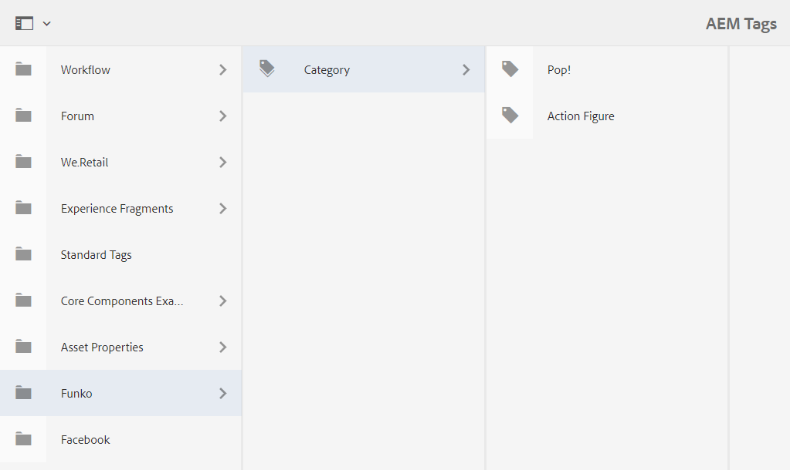

# Page Properties

**Overview**

Page properties are very important in AEM, because you can store many data there which can be useful in your website.
We will see how to read data from it with our component and customize it with new tabs.

**Table of contents**

- [Page Properties](#page-properties)
  - [Default Properties](#default-properties)
  - [Get Properties](#get-properties)
  - [Custom Properties](#custom-properties)

## Default Properties


If we open the page properties of the webpage `en`, we can see a list of tabs, a multiple inputs to set information.

You can access all of it from any of your components.

You can find documentation about every property [here](https://helpx.adobe.com/experience-manager/6-2/sites/authoring/using/editing-page-properties.html).

At the `basic` tab we can see a input named `Tags`. We are going to use this property, so (if you remember from [chapter 2 Tagging](../2_aem_interface/Readme.md#tagging)) let's create some tags.



and select the `Pop!` one for our page.


Save and close the properties.

## Get Properties

Open our `FunkoProductModel` file and let's access the property tags from here. To do so, add the following attribute to the class
```
@SlingObject
private ResourceResolver resourceResolver;

private String[] tags;
```

Add also the respective `getter` for the `tags` attribute, since we are going to modify the html template.

Thanks to this `ResourceResolver` we are going to be able to access the `PageManager` and from there, the Page itself. Like this:
```
PageManager pageManager = resourceResolver.adaptTo(PageManager.class);

Page currentPage = pageManager.getContainingPage(currentResource);
this.tags = currentPage.getProperties().get("cq:tags", String[].class);
for (int ii = 0; ii < this.tags.length; ii++)
    this.tags[ii] = this.tags[ii] = this.tags[0].substring(this.tags[ii].lastIndexOf("/") + 1);
```

Add that code to the `init()` method.

1. Get a `PageManager` from the `ResourceResolver`

2. Get the `current Page` from this `PageManager`

3. Get the property `tags` of the PageProperties (it is an array of String)

4. Modify the value so instead of `funko:category/pop!` we get just `pop!`

To check which is the value of the property you want to access, go to `/libs/wcm/foundation/components/page` at the `CRXDE Lite`. Down there, you can see all the tabs that comes by default.


As we want the property `tags`, which is inside the `basic` tab, browse it, and check the `name` attribute


As you can see, it works very similar to the dialog of a component. That is because a page is also a component, even you can find it inside your `apps/components` package


If you check the `.content.xml` file, you can see that the `sling:resourceSuperType` is `core/wcm/components/page/v2/page`, but if you track that path in the CRXDE, you won't find all the tabs.

Reason is nested heritance. The component at that path inherits from another one. You just need to follow that heritance to find what you are looking for. 

The modification in our html template is just adding this code under the `Item number` paragraph
```
<sly data-sly-test="${funkoProduct.tags && funkoProduct.tags.length > 0}">
  <p>
    <strong>Category: </strong>
    <sly data-sly-list="${funkoProduct.tags}">
    <a href="#">${item}${itemList.middle || itemList.first ? ', ':''}</a>
    </sly>
  </p>
</sly>
```

We create a link because later on, at [chapter 8](../8_query_builder/Readme.md) (Query Builder) we are going to implement a search for our products.

The output of our component will have now a new field called `category` where all the tags will be displayed


## Custom Properties

In order to customize the properties of a page, we need to create a dialog inside our `Page` component.


Copy this code inside
```
<?xml version="1.0" encoding="UTF-8"?>
<jcr:root xmlns:sling="http://sling.apache.org/jcr/sling/1.0" xmlns:cq="http://www.day.com/jcr/cq/1.0"
          xmlns:jcr="http://www.jcp.org/jcr/1.0" xmlns:nt="http://www.jcp.org/jcr/nt/1.0"
          jcr:primaryType="nt:unstructured"
          sling:resourceType="cq/gui/components/authoring/dialog">
    <content jcr:primaryType="nt:unstructured">
        <items jcr:primaryType="nt:unstructured">
            <tabs jcr:primaryType="nt:unstructured">
                <items jcr:primaryType="nt:unstructured">
                    
                </items>
            </tabs>
        </items>
    </content>
</jcr:root>
```

This is the basic structure we need to customize the page properties.

Inside the `items` tag, we can override the existing tabs or create new ones.

For example, adding this node, we can hide the `permissions` tab.
```
<permissions
    jcr:primaryType="nt:unstructured"
    sling:hideResource="{Boolean}true"/>
```

And adding this one, we create a custom tab named `Product`, with a property `Product name` and a `Defaul image`.
```
<products
        cq:showOnCreate="{Boolean}true"
        jcr:primaryType="nt:unstructured"
        jcr:title="Product"
        sling:resourceType="granite/ui/components/coral/foundation/fixedcolumns">
    <items jcr:primaryType="nt:unstructured">
        <column
                jcr:primaryType="nt:unstructured"
                sling:resourceType="granite/ui/components/coral/foundation/container">
            <items jcr:primaryType="nt:unstructured">
                <default-name
                        cq:showOnCreate="{Boolean}true"
                        jcr:primaryType="nt:unstructured"
                        sling:resourceType="granite/ui/components/coral/foundation/form/textfield"
                        fieldLabel="Product name"
                        name="./default-name"/>
                <default-image
                        cq:showOnCreate="{Boolean}true"
                        jcr:primaryType="nt:unstructured"
                        sling:resourceType="granite/ui/components/coral/foundation/form/pathfield"
                        fieldLabel="Default Image"
                        name="./default-image"/>
            </items>
        </column>
    </items>
</products>
```


Now we can see our new tab inside the `Page Properties`.

Update your `FunkoProductModel` to set as default the name and the gallery if no data provided by the dialog.

If you add a new funko product with just the `item number` property and set the `page properties`, you will se that the product loads with the data.


But the other one remains as the same, because the the value introduced at the dialog has preference.

**You can download the code of this chapter [here](assets/FunkoChapter4.zip).**


---

In the [next chapter](../5_content_fragments/Readme.md) (Content Fragments) we will create and use the `Content Fragments` of AEM.

**Guide contents**
- [Maven Project](../1_maven_project/Readme.md)
- [AEM Interface](../2_aem_interface/Readme.md)
- [Components](../3_components/Readme.md)
- [Page Properties](../4_page_properties/Readme.md)
- [Content Fragments](../5_content_fragments/Readme.md)
- [Experience Fragments](../6_experience_fragments/Readme.md)
- [Templates](../7_templates/Readme.md)
- [Query Builder](../8_query_builder/Readme.md)