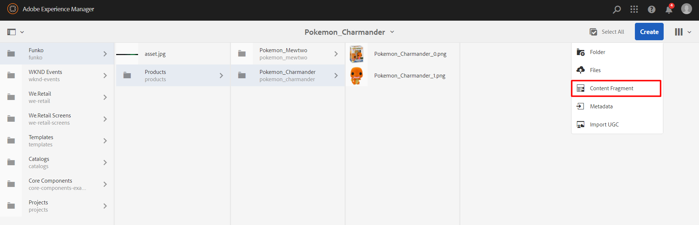
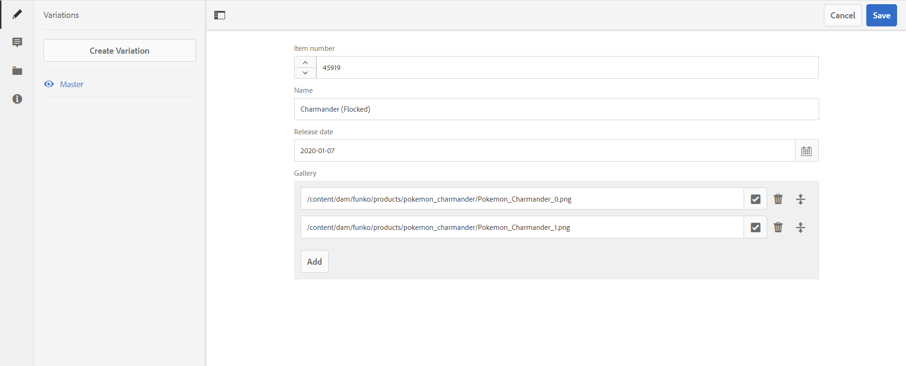

# Content Fragments

**Overview**

Content Fragments in AEM are used to store information we want to use in other place. They are similar to components but you just need to define the dialog.

**Table of contents**

- [Content Fragments](#content-fragments)
  - [Product CF](#product-cf)
  - [Instantiate](#instantiate)
  - [Reading](#reading)

## Product CF

We are going to create a Content Fragment for our Funko Product.

In order to do that, we need to create a folder structure inside our project.

Inside the `settings` folder of `content`, we can see a folder named `wcm`. Create a folder `dam` next to it and the following


Inside each `.content.xml` file (expect the one inside `funkoProduct`) add this
```
<?xml version="1.0" encoding="UTF-8"?>
<jcr:root xmlns:cq="http://www.day.com/jcr/cq/1.0" xmlns:jcr="http://www.jcp.org/jcr/1.0"
          jcr:primaryType="cq:Page">
    <cfm/>
</jcr:root>
```
Replace the `<cfm/>` tag for the current folder which is inside.

Example:	
`cmf/.content.xml` should have `<models/>`

The last `.content.xml` will be the `Content Fragment` itself.

The structure is very similar to the component's one, but it is a little peculiar.

1. Some of the fields are different. You can check the special ones in the CRXDE under the path `/libs/dam/cfm/models/editor/components`

2. Be careful with multifields, try to avoid multivalue multifields as much as possible and do not nest them

3. The content itself does not need to be inside the file

4. Need some attributes to work, like `metaType` and `valueType`

This is the content of that `.content.xml`
```
<?xml version="1.0" encoding="UTF-8"?>
<jcr:root xmlns:sling="http://sling.apache.org/jcr/sling/1.0" xmlns:cq="http://www.day.com/jcr/cq/1.0"
          xmlns:jcr="http://www.jcp.org/jcr/1.0" xmlns:nt="http://www.jcp.org/jcr/nt/1.0"
          jcr:primaryType="cq:Template"
          allowedPaths="[/content/entities(/.*)?]"
          ranking="{Long}100">
    <jcr:content
            cq:lastModified="{Date}2019-10-10T13:00:15.903+02:00"
            cq:lastModifiedBy="admin"
            cq:scaffolding="/conf/funko/settings/dam/cfm/models/funkoProductTop/jcr:content/model"
            cq:templateType="/libs/settings/dam/cfm/model-types/fragment"
            jcr:primaryType="cq:PageContent"
            jcr:title="Funko Product"
            sling:resourceSuperType="dam/cfm/models/console/components/data/entity"
            sling:resourceType="dam/cfm/models/console/components/data/entity/default">
        <model
                cq:targetPath="/content/entities"
                jcr:primaryType="cq:PageContent"
                sling:resourceType="wcm/scaffolding/components/scaffolding"
                dataTypesConfig="/mnt/overlay/settings/dam/cfm/models/formbuilderconfig/datatypes"
                maxGeneratedOrder="20">
            <cq:dialog
                    jcr:primaryType="nt:unstructured"
                    sling:resourceType="cq/gui/components/authoring/dialog">
                <content
                        jcr:lastModified="{Date}2019-10-10T13:00:15.903+02:00"
                        jcr:lastModifiedBy="admin"
                        jcr:primaryType="nt:unstructured"
                        sling:resourceType="granite/ui/components/coral/foundation/fixedcolumns">
                    <items
                            jcr:primaryType="nt:unstructured"
                            maxGeneratedOrder="25">
                        <item-no
                                jcr:primaryType="nt:unstructured"
                                sling:resourceType="granite/ui/components/coral/foundation/form/numberfield"
                                metaType="number"
                                renderReadOnly="false"
                                showEmptyInReadOnly="true"
                                valueType="long"
                                fieldLabel="Item number"
                                step="1"
                                required="true"
                                name="item-no"/>
                        <name
                                jcr:primaryType="nt:unstructured"
                                sling:resourceType="granite/ui/components/coral/foundation/form/textfield"
                                metaType="text-single"
                                renderReadOnly="false"
                                showEmptyInReadOnly="true"
                                valueType="string"
                                fieldLabel="Name"
                                name="name"/>
                        <release
                                jcr:primaryType="nt:unstructured"
                                sling:resourceType="granite/ui/components/coral/foundation/form/datepicker"
                                metaType="date"
                                valueType="string"
                                valueFormat="YYYY-MM-DD"
                                displayedFormat="YYYY-MM-DD"
                                fieldLabel="Release date"
                                name="release"/>
                        <gallery
                                jcr:primaryType="nt:unstructured"
                                sling:resourceType="granite/ui/components/coral/foundation/form/multifield"
                                filter="hierarchy"
                                metaType="reference"
                                nameSuffix="contentReference"
                                renderReadOnly="false"
                                showEmptyInReadOnly="true"
                                valueType="string[]"
                                rootPath="/content/dam/funko/products"
                                fieldLabel="Gallery"
                                name="image">
                            <field
                                    jcr:primaryType="nt:unstructured"
                                    sling:resourceType="dam/cfm/models/editor/components/contentreference"
                                    name="image"
                                    renderReadOnly="false"
                                    rootPath="/content/dam/funko/products"/>
                        </gallery>
                    </items>
                </content>
            </cq:dialog>
        </model>
    </jcr:content>
</jcr:root>
```

If you check the first `jcr:content`, you can see the attribute
```
cq:scaffolding="/conf/funko/settings/dam/cfm/models/funkoProductTop/jcr:content/model"
```
This attribute specifies the absolute path where the `model` tag is found. That is the reason why you don't need the CF and the content to be at the same file.

Notice also the multifield structure.

We have created our own `Content Fragment Model`, congrats, it was pretty easy.

## Instantiate

You can now see it in the AEM under `tools > assets > Content Fragment Models > Funko`


Go to your `Funko assets` and create inside the Charmander product



And select `Funko Product` fragment. You need to give it a `title`, and then open it to fill it with data.



The dialog is the same but we can see a side toolbar.

At the &#x1f6c8; option (Metadata) we can find more customization of the CF, even we can add `tags` to it.

Now modify the `content.xml` dialog of our `FunkoProduct` component so it can accept a link to this `Content Fragment` (you may use a `pathfield`), but keep all other inputs.

Now you should think that we have duplicated content, but that is not true, since none of that inputs are required.

We have to apply a priority to all that data

`Component dialog > Page properties > Content fragment`

With this priority, we can override the values of the `Content fragment` if needed, in case none is provided or we want to change it.

## Reading

Before reading the `Content Fragment`, we need to add a pathfield to our `form dialog` of our component

```
<cf
    jcr:primaryType="nt:unstructured"
    sling:resourceType="granite/ui/components/coral/foundation/form/pathfield"
    rootPath="/content/dam/funko/products"
    name="./cf"/>
```

Now get the resource in your java model and adapt it to the `ContentFragment` class

```
this.cf = currentResource.getValueMap().get("cf", String.class);

Resource resourceChild = resourceResolver.getResource(this.cf);
ContentFragment contentFragment = resourceChild.adaptTo(ContentFragment.class);
```

&#9888; The `Content Fragment` path is not mandatory, so make sure to handle any exception.

In order to get the values from the `Content Fragment`, we can read the data using
```
contentFragment.getElement("item-no").getValue().getValue(String.class)

contentFragment.getElement("gallery").getValue().getValue(String[].class)
```

Now it is up to you to implement it in the code following the priority we set before:

`Component dialog > Page properties > Content fragment`

&#9888; Notice that the `page properties` for the value `default image` is only used if no gallery is provided

**You can download the code of this chapter [here](assets/FunkoChapter5.zip).**

In the [next chapter](../6_experience_fragments/Readme.md) (Experience Fragments) we will create and use the `Experience Fragments` of AEM to create a nav and footer.

---

**Guide contents**
- [Maven Project](../1_maven_project/Readme.md)
- [AEM Interface](../2_aem_interface/Readme.md)
- [Components](../3_components/Readme.md)
- [Page Properties](../4_page_properties/Readme.md)
- [Content Fragments](../5_content_fragments/Readme.md)
- [Experience Fragments](../6_experience_fragments/Readme.md)
- [Templates](../7_templates/Readme.md)
- [Query Builder](../8_query_builder/Readme.md)